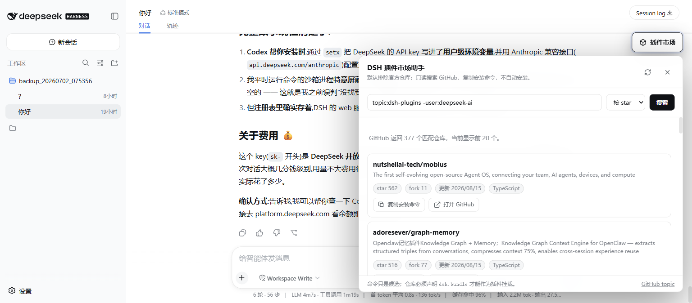

# DSH Plugin Market

> The loud little plugin radar DeepSeek Harness should have shipped with.

[](https://deepseek.com/harness/)
[](https://github.com/topics/dsh-plugins)
[](LICENSE)

`dsh-plugin-market` adds a floating GitHub-powered plugin browser to DeepSeek Harness Web. It is intentionally small, fast, and non-invasive: search repositories, compare stars, open GitHub, copy the install command, then decide for yourself.



## Why This Exists

DeepSeek Harness says everything is a plugin. Great. But the ecosystem is already noisy: topics, awesome lists, random forks, half-working experiments, and hidden gems are all mixed together.

This plugin gives you a radar inside DSH:

- Find DSH-related repositories without leaving the app.
- See stars, forks, language, update time, and descriptions at a glance.
- Copy a candidate `dsh plugin --profile web add ...` command.
- Stay safe: no automatic remote install, no API key access, no hidden writes.

## Features

- Default search: `topic:dsh-plugins -user:deepseek-ai`.
- Sort by stars, update time, or forks.
- Open matching repositories on GitHub.
- Copy install commands.
- Works as a DSH Web client plugin.
- No build step.
- No dependencies.
- No token storage.

## Install

```powershell
dsh plugin --profile web add github:2160039878-cyber/dsh-plugin-market
dsh web
```

Open `http://127.0.0.1:3080/` and look for the `插件市场` button in the top-right corner.

## Local Development

```powershell
git clone https://github.com/2160039878-cyber/dsh-plugin-market.git
cd dsh-plugin-market
npm run check
dsh plugin --profile web add file:$PWD
dsh web
```

## Rollback

```powershell
dsh plugin --profile web remove dsh-plugin-market
```

## Safety Model

This project is a browser-side helper. It reads public GitHub repository search results through the GitHub Search API and renders them in DSH Web.

It does not:

- read DSH API keys;
- install remote code automatically;
- write to your DSH profile by itself;
- call private GitHub APIs;
- persist repository lists locally.

## Status

MVP. Useful now, intentionally not clever yet.

Planned only if needed:

- installed-plugin detection;
- verified `dsh.bundle` badge;
- better category filters;
- GitHub rate-limit status;
- one-click install behind explicit confirmation.

## License

MIT
